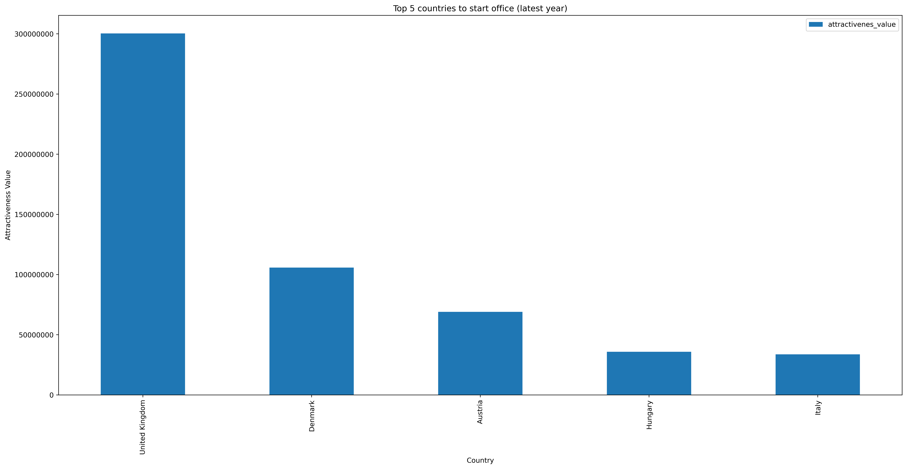

# Best place to start an office in IT sector in Europe
This project is about analysing different datasets such as  gdp of different EU countries , percentage of ict sector on gdp, percentage of cloud computing services data and 
find out which country is best suitable to start a office in IT sector.  
Pipeline Consists of various scripts:
 1. etl. py : main file whcich handles different analytic functions
 2. etl_functions.py: functions consists of different analytics jobs
 3. helper: functions to read and visualize data

Data sources used:
  1. GDP data of EU countries - gdpdata.csv csv format
  2. Percentage of the ICT sector on GDP - jsonstat format
  3. Cloud computing services data - jsonstat format

Before running the code, please install the ncecessary libraries using following command
```
  pip install -r requirements.txt

```
Run following command to execute the code.
```
python etl.py
```
Application creates the different plots which helps to take the business decisions.

## Architecture Diagram
The architecture consists of three modules.

1. Data source module: it is the module from which we reads the data 
2. Transform module: Module to preprocess and transform the data according to the format in which we need. 
   It also contains analysis submodule to analyse the data based on the business needs.
3. Visualisation Module: Create and store the plots which helps to make business decisions.


## Analysis and Findings
The attractiveness values is computer using following formula.

Attractiveness of a country = GDP *  Usage of cloud computing in IT sector in a country * Pecentage of ICT sector from GDP 

From the analysis, we can see that United Kingdom  has best attractiveness value when considering  latest years data


